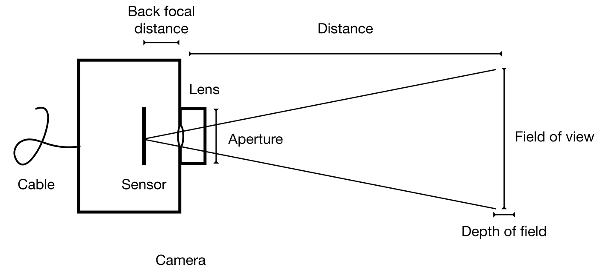

*Author: Emily Cloutier*

Camera
======

Sensors
-------

-   CCD vs CMOS: CMOS can usually go faster, but can have linearity
    issues (low vs high signals). CCDs are slower, but the most stable
    cameras.
-   Rolling vs global shutter: determines if all pixels are on the same
    reading clock.
-   Polychromatic vs monochromatic: polychromatic sensors capture
    spectral information at the cost of spatial resolution.
-   Polarized: polarized sensors capture polarization information at the
    cost of spatial resolution.

Noise 
-----

-   Read noise: sensor-dependent.
-   Dark noise: $\uparrow$ integration time, $\downarrow$ cooling
    (cooling reduces dark noise **and** makes it stable over time).
-   Shot noise: $\downarrow$ integration time. $SNR = \sqrt{N}$
-   Radiative noise: $\downarrow$ distance from radiation field,
    $\downarrow$ median temporal filter.
-   Background signal: take background frames and reduce external light
    contamination.

Dynamic range
-------------

-   Determines how the signal is encoded: 8, 10, 12, or 16 bits.
    Determines the number of possible gray values. Max gray value:
    $2^n$, do not saturate the sensor!

Dead time
---------

-   The time between frames during which the signal is lost.

Integration time 
----------------

-   The duration of a frame.

Pixels 
------

-   Number
-   Size

Lenses
======

Mount
-----

-   A camera mount type is associated with a backfocal distance. The
    backfocal distance of a lens has to match the backfocal distance of
    the camera. Be careful when using an adapter.

Focal length
------------

-   Fixed vs variable. To adjust the focal length, image an object with
    fine details (e.g., text) at the distance of measurements.

Aperture
--------

-   Some lenses have a tunable aperture: iris diameter. The aperture is
    usually given in terms of $F/\#$ (dimensionless).

Cables
======

-   USB: has to be boosted for lengths $>$ 30 m.
-   USB-C: can also power the camera.
-   Ethernet: has to be boosted for lengths $>$ 90 m.

Image quality/characteristics
=============================

Contrast
--------

$$
    \text{Percent contrast} = \left(\frac{I_{\max} - I_{\min}}{I_{\max} + I_{\min}}\right) \times 100
$$

SNR
---

$$
    SNR = \frac{\mu_s}{\sigma_s}
$$

-   $\uparrow$ Integration time
-   $\uparrow$ Aperture
-   $\downarrow$ Distance of radioluminescence
-   $\uparrow$ Pixel sizes ($\mu$m)

Spatial resolution
------------------

-   If diffraction-limited: $$\approx \text{FOV} / n_{\text{pix}}$$ Otherwise,
    measured from MTF.
-   $\downarrow$ Field of view: you should use the smallest field of
    view possible (that enables complete imaging of the object).
-   $\uparrow$ Number of pixels

Temporal resolution 
-------------------

- $\propto$ Integration time

Depth of field 
--------------

-   The distance over which the lens can retain reasonably good focus
-   $\downarrow$ Aperture

Field of view
-------------

$$\begin{aligned}
    \text{AFOV} &= 2 \times \tan^{-1}\left(\frac{\text{height}_{\text{sensor}}}{2f}\right) \\
    \text{FOV} &= 2 D \times \tan \left(\frac{\text{AFOV}}{2}\right)
\end{aligned}$$

Image processing
================

-   Median spatial filter, median temporal filter, distortion
    correction, hyperspectral formalism, polarization imaging, OpenCV.
